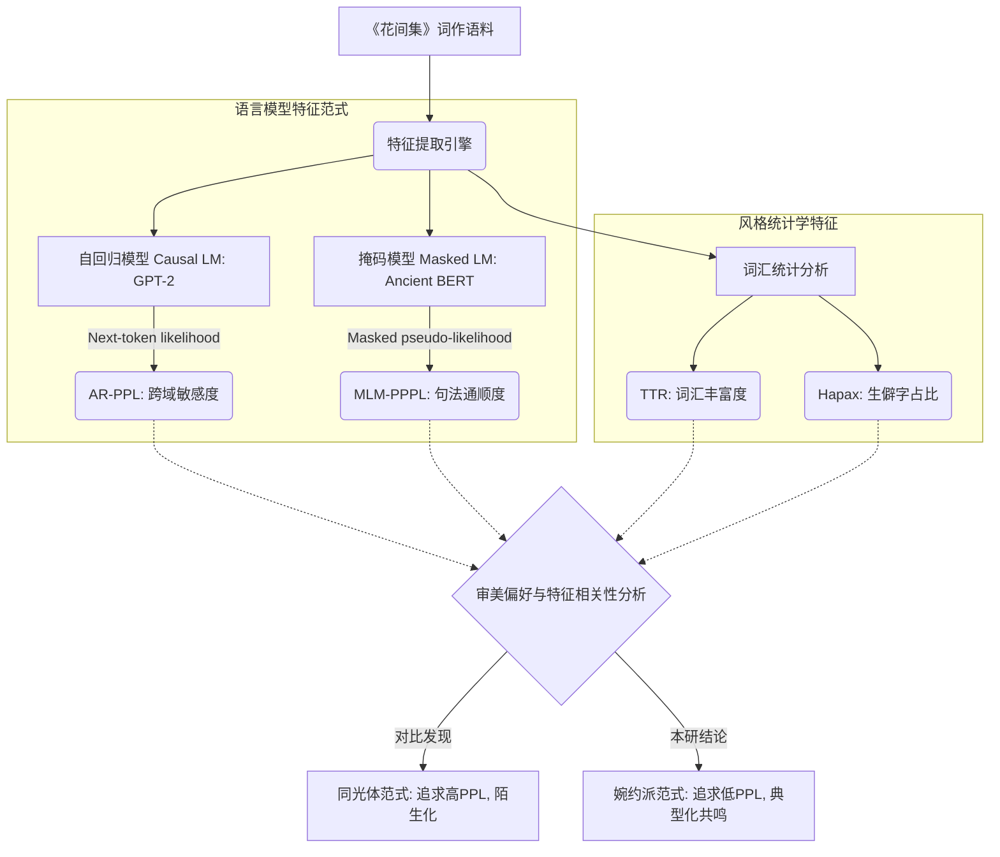

## 摘要
近年来，利用大语言模型（LLM）的困惑度（Perplexity, PPL）作为文学风格量化指标的研究逐渐兴起。既往研究指出，在晚清“同光体”诗歌中，高困惑度往往对应着极高的艺术评价，体现了该流派“生涩奥衍”的审美追求。本文以《花间集》为研究对象，结合明代文学家汤显祖的评点数据，引入自回归（Causal LM）与掩码语言模型（Masked LM）两种计算范式提取语义与风格特征。研究发现，婉约派词作呈现出与“同光体”截然相反的评估特征：受名家偏好的词作，其困惑度与评价呈强负相关（系数达 -0.83）。这一发现揭示了婉约词“文从字顺、辞采丰赡、拒绝生僻”的审美特质，证明在计算美学领域，不同文学流派需采用差异化的量化评估范式。

## 1. 引言与背景

大语言模型在自然语言处理领域的突破，为计算诗学提供了新的量化工具。困惑度（PPL）作为衡量语言模型预测下一个词难度的核心指标，能够有效反映文本的“陌生化”或“生僻度”。

在近期的相关研究（如 arXiv:2409.00060）中，研究者指出“同光体”诗歌的平均 PPL 显著高于普通诗歌。在该流派语境下，高 PPL 往往对应着专家的“佳作”标注，这与其极度推崇“学人之诗”、追求用典僻涩的艺术张力高度吻合。然而，中国古典诗词流派众多。本文旨在探讨以《花间集》为代表的“婉约派”词作，其审美评价（以汤显祖评点为基准）与大模型特征之间是否存在不同的量化规律。

## 2. 评估架构与指标设计

为了全面捕捉古文的语义与风格特征，并验证结论的鲁棒性，本研究构建了基于双重范式的特征提取与评估流程：

### 2.1 审美偏好标注
本研究提取了《花间集》中带有汤显祖明确评注的 193 首词作作为正样本（偏好集），以及 312 首无评注的词作作为负样本（对照集），共计 505 首样本，以此构建审美偏好信号。

### 2.2 量化特征定义
1. **困惑度（PPL / PPPL）**：分别使用针对古文优化的 GPT-2 自回归模型计算 AR-PPL，以及使用 Ancient BERT 计算伪困惑度（MLM-PPPL）。两者从不同模型架构维度衡量文本在古汉语语法下的通顺连贯性与不可预测性。
2. **词汇丰富度（TTR）**：Type-Token Ratio，衡量用词的多样性与意象密度。
3. **生僻字占比（Hapax）**：衡量词作中仅出现一次的罕见字汇比例。

## 3. 实验结果与发现

通过对上述特征进行相关性分析与分类建模，我们观测到了与“同光体”研究截然相反的数据分布特征。

### 3.1 婉约词审美的“反向”评估特征
实验数据显示，汤显祖对婉约词的偏好与量化特征呈现出高度一致的逻辑性，概括为：“文从字顺，辞采丰赡，拒绝生僻”。

* **困惑度强负相关（核心发现）**：在 Ancient BERT 提取的特征中，PPPL 与偏好信号呈现极强的负相关（相关系数 -0.83）。汤显祖极度偏爱在古文语法下高度通顺、连贯的作品。PPL 越低，越容易获得评注青睐。这与同光体“高 PPL 对应佳作”的规律完全反转。
* **高信息密度与低生僻度**：TTR 呈现显著正相关（系数 +0.38），而 Hapax 呈现负相关（系数 -0.46）。这表明在通顺的基础上，优秀的婉约词要求意象密集、词汇多变，但拒绝依赖生僻字典故的堆砌。

### 3.2 跨模型架构的鲁棒性与分布差异
为验证结论不依赖于单一模型架构，我们在 GPT-2 自回归范式下进行了正交实验：
1. **跨域敏感性**：自回归 PPL 在区分《花间集》与现代白话仿写词作时展现出极高的区分度（AUC > 0.92），证明该指标能精准捕捉古词的领域边界与文体偏离。
2. **浅层统计的局限性**：在《花间集》内部的偏好二分类任务中，基于自回归 PPL 与浅层统计特征的模型性能（AUC ~0.54）与 BERT 范式结果高度一致。这进一步印证了基于纯文本通顺度的浅层特征无法完全包揽古典诗词的深层评价（如意境、格律），但也稳定地揭示了“高 PPL ≠ 佳作”的底线逻辑。

## 4. 讨论与美学解释

### 4.1 审美维度的二元对立：陌生化 vs 共鸣
本研究提出的“反向评估特征”揭示了中国古典诗词两种截然不同的审美机制：

1. **同光体模式（高 PPL）**：追求“陌生化”。通过打破常规语言习惯、使用生僻典故创造艺术张力。此时，语言模型的高预测难度（高 PPL）恰好量化了这种“生涩奥衍”。
2. **婉约派模式（低 PPL + 高 TTR）**：追求“典型化”与“共鸣”。汤显祖推崇的婉约词，其最高境界是“平字见奇”。意象组合丰富（高 TTR），但选用的多是典型意象，句法高度符合自然韵律（低 PPL、低 Hapax）。这种语言的流利度不仅让读者“心领神会”，也极大地降低了 LLM 的预测难度。

### 4.2 模型领域差异对 PPL 量级的影响
需要指出的是，困惑度的绝对数值高度依赖于预训练语料的分布。在专门针对诗词微调的模型（如 MOSS 诗词版）中，PPL 通常处于极低个位数；而在本研究使用的广泛古文/古汉语预训练模型中，PPL 通常处于百级区间。然而，尽管绝对数值存在量级差异，作为衡量文本“生僻度”的相对指标，困惑度在表征流派风格特征上的相对趋势依然稳健。

## 5. 结论

本文通过计算美学的方法，验证了在《花间集》及汤显祖评点体系下存在的“PPL 反向评估特征”。双重语言模型架构的实验表明，婉约派词作的艺术偏好与大模型困惑度呈现强负相关。这一发现修正了“文学性等于不可预测性”的单一技术视角，提示在利用人工智能进行文学评估时，必须针对不同流派风格（追求“惊奇”抑或“流畅中的繁复”）建立差异化的量化评估范式。

### 局限性
本文将“有无评注”作为偏好信号，未细分评注的显式情感极性（褒/贬）。此外，研究结果暂局限于《花间集》体系，未来可引入词牌、篇幅等变量进行更精细的回归控制，并扩展至其他流派词集以检验外部有效性。

## 参考文献 (References)

[1] Zhao, C., Wang, B., & Wang, Z. (2024). *Understanding Literary Texts by LLMs: A Case Study of Ancient Chinese Poetry*. arXiv preprint arXiv:2409.00060.
[2] 汤显祖. (明). 《玉茗堂评花间集》.
[3] Devlin, J., Chang, M. W., Lee, K., & Toutanova, K. (2018). *BERT: Pre-training of Deep Bidirectional Transformers for Language Understanding*. arXiv preprint arXiv:1810.04805.
[4] Radford, A., Wu, J., Child, R., Luan, D., Amodei, D., & Sutskever, I. (2019). *Language Models are Unsupervised Multitask Learners*. OpenAI blog, 1(8), 9.
[5] Jihuai. (2023). *bert-ancient-chinese*. Hugging Face. Retrieved from https://huggingface.co/Jihuai/bert-ancient-chinese
[6] Zhao, Z. et al. (2019). *UER: An Open-Source Toolkit for Pre-training Models*. EMNLP-IJCNLP 2019. (uer/gpt2-chinese-ancient & uer/gpt2-chinese-poem)